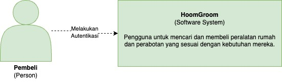

# HoomGroom
**Kelompok A06 - Pemrograman Lanjut - 2023/2024 Genap**

**HoomGroom** adalah platform e-commerce yang memampukan pengguna untuk mencari dan membeli peralatan rumah dan perabotan yang sesuai dengan kebutuhan mereka.

Aplikasi kami dapat diakses melalui tautan berikut [ini](https://home-furniture-fe.vercel.app).

## Anggota Kelompok
Kelompok A6:

| NPM | Nama |
| -- | -- |
| 2206083552 | Devandra Reswara Arkananta
| 2206081534 | Akmal Ramadhan
| 2206032425 | Johanes Wisanggeni
| 2206081502 | Ryandhika Al Afzal
| 2206082013 | Naufal Ichsan

## Repositori:
- Autentikasi: https://github.com/advpro-project/hoomgroom-authentication
- Pengiriman Produk: https://github.com/advpro-project/home-furniture-delivery
- Membeli Produk: https://github.com/advpro-project/home-furniture-buyProduct
- Promo: https://github.com/advpro-project/home-furniture-CRUD_Product_Promo
- Front End: https://github.com/advpro-project/home-furniture-fe

# Modul 12: Software Architecture
## Context Diagram

Untuk mengakses aplikasi kami, pengguna melakukan autentikasi terlebih dahulu. Pengguna yang belum melakukan registrasi dapat mendaftarkan sebagai pembeli atau admin. Jika pengguna sudah punya akun, pengguna hanya perlu melakukan login saja.

## Container Diagram
TODO:

## Deployment Diagram
TODO:

