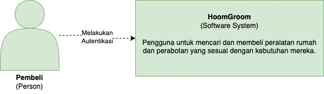

# HoomGroom
**Kelompok A06 - Pemrograman Lanjut - 2023/2024 Genap**

**HoomGroom** adalah platform e-commerce yang memampukan pengguna untuk mencari dan membeli peralatan rumah dan perabotan yang sesuai dengan kebutuhan mereka.

Aplikasi kami dapat diakses melalui tautan berikut [ini](https://home-furniture-fe.vercel.app).

## Anggota Kelompok
Kelompok A6:

| NPM | Nama |
| -- | -- |
| 2206083552 | Devandra Reswara Arkananta
| 2206081534 | Akmal Ramadhan
| 2206032425 | Johanes Wisanggeni
| 2206081502 | Ryandhika Al Afzal
| 2206082013 | Naufal Ichsan

## Repositori:
- Autentikasi: https://github.com/advpro-project/hoomgroom-authentication
- Pengiriman Produk: https://github.com/advpro-project/home-furniture-delivery
- Membeli Produk: https://github.com/advpro-project/home-furniture-buyProduct
- Promo: https://github.com/advpro-project/home-furniture-CRUD_Product_Promo
- Front End: https://github.com/advpro-project/home-furniture-fe

# Modul 12: Software Architecture
## Current Diagram
### Context Diagram

Untuk mengakses aplikasi kami, pengguna melakukan autentikasi terlebih dahulu. Pengguna yang belum melakukan registrasi dapat mendaftarkan sebagai pembeli atau admin. Jika pengguna sudah punya akun, pengguna hanya perlu melakukan login saja.

### Container Diagram

Aplikasi kami terdiri dari beberapa _container_ yang saling berinteraksi satu sama lain. _Container_ yang ada di dalam aplikasi kami adalah:
- Autentikasi
- CRUD Furniture dan Promo
- CRU Delivery
- Transaksi Pembelian Produk

### Deployment Diagram

Deployment aplikasi menggunakan Google Cloud Platform pada _backend_. Setiap _container_ di-_deploy_ di _virtual machine_ yang berbeda-beda. Tidak hanya itu, setiap _container_ juga memiliki _database_ yang berbeda-beda. Setiap _database_ kami _deploy_ melalui Supbase. Untuk _deploy_ _frontend_, kami menggunakan Vercel.

## Future Architecture
Berikut adalah hasil diskusi menggunakan metode _risk storming_.

### Identifikasi Risiko
1. Keamanan pada Transaksi Data
Data sensitif pengguna dan transaksi dapat menjadi rentan terhadap kebocoran atau serangan.

2. Banyaknya Microservice
Mengelola dan mengoperasikan banyak microservices dapat menjadi sangat rumit bagi kami.

3. Ketergantungan pada _Third Party_
Aplikasi menggunakan layanan _third party_ seperti Supabase, Vercel, dan GCP. Jika salah satu layanan tersebut mengalami _downtime_, aplikasi kami juga akan terdampak.

### Konsensus

Risiko | Dampak | Kemungkinan | Penilaian Kami |
-- |--------| -- |----------------|
Keamanan pada Transaksi Data | Tinggi | Tinggi | 9              |
Banyaknya Microservice | Sedang | Sedang | 7              |
Ketergantungan pada _Third Party_ | Sedang | Rendah | 6              |

### Mitigasi
Karena menurut kami yang paling berdampak adalah keamanan pada transaksi data, kami akan fokus pada mitigasi risiko tersebut. Kami akan melakukan enkripsi data sensitif pengguna dan transaksi menggunakan _end-to-end encryption_.

---

